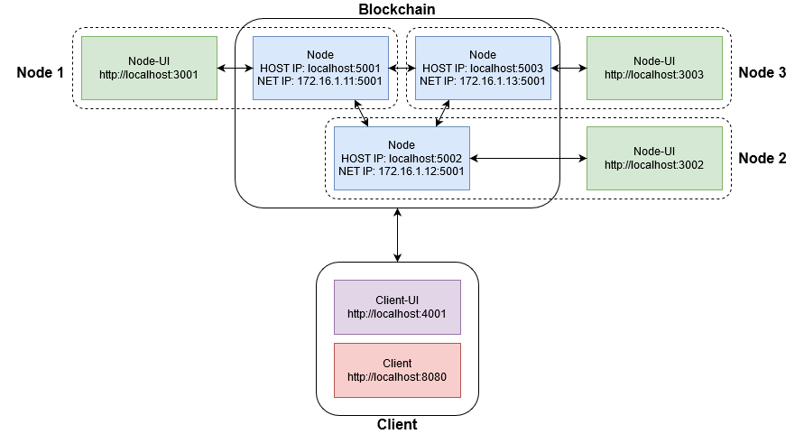
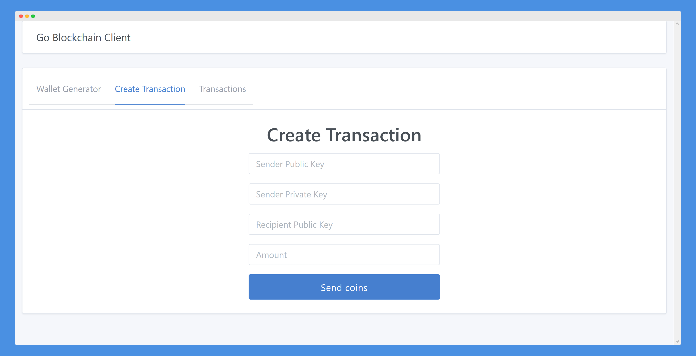
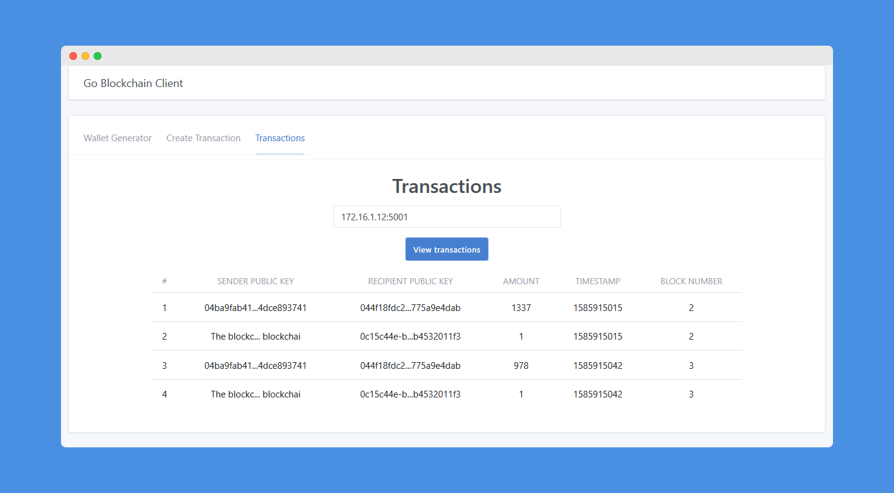
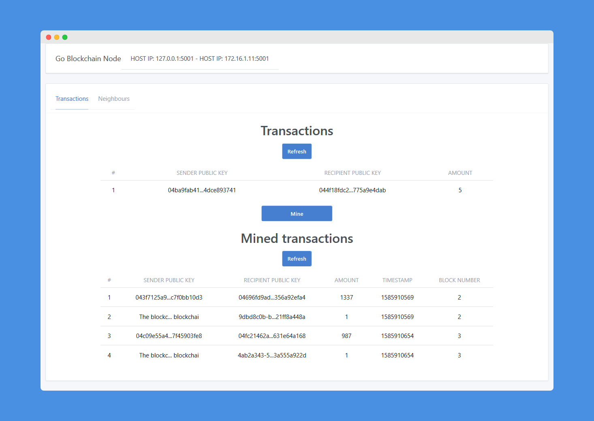
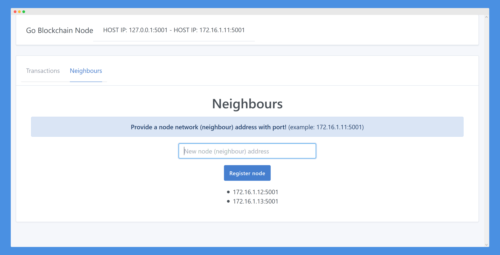

# About GoBlockchain
A basic Blockchain implementation written in Golang. Project presents low level build of blockchain network that is formed by decentalized nodes. To illustrate basic operations covered by nodes, each step is displayed to user interface in order to understand flow of information (transactions, blocks) and processes (mining, resolving conflicts between neighbours).

Moreover besides the network, clients are able to create own wallet (private and public keys generation) instruct a new transactions and view currently verified transactions based on node chosen by ip address.

## Embraced topics
- Nodes
    - Neighbours
    - Mining
        - Proof-Of-Work (nonce guessing)
        - Hashing
        - Adding block
        - Reward transaction for mined block
    - Consensus Protocol (resolving chains conflict between nodes/neighbours)
- Client
    - Wallet generation (private and public keys based on ECDSA)
    - Creating transaction (signing transaction cryptographically)
    - Sending transaction to certain node

## Package Structure
```
    GoBlockchain    # Root Package
    .
    ├── blockchain          # Node back-end files
    │   └── ui              # Node react interface
    |
    └── blockchain_client   # Client back-end files
        └── ui              # Client react interface
```
## Running the example
In the base folder 
```
docker-compose up -d
```
will run 3 nodes, 1 client and UIs for each participant as below



## Features
- Client
    - Wallet generator
        
    - Create Transaction
        
    - Confirm Transaction (creating signature for transaction)
        
    - View transactions (downloading transaction from mined blocks)
        
- Node
    - View unverified transactions pool and mined transaction
        
    - Neigbours management
        

## Future work
- gossip transactions

## React design helpers
- [Tabler React](http://tabler-react.com/documentation/#forminputreact)
- [React Bootstrap](https://react-bootstrap.netlify.com/components/modal/#modals)

## Project inpiration
- [OutsideTheCode](https://www.youtube.com/channel/UCuxN2UqjhvvfXfiV2h9N_Jg/featured) 
